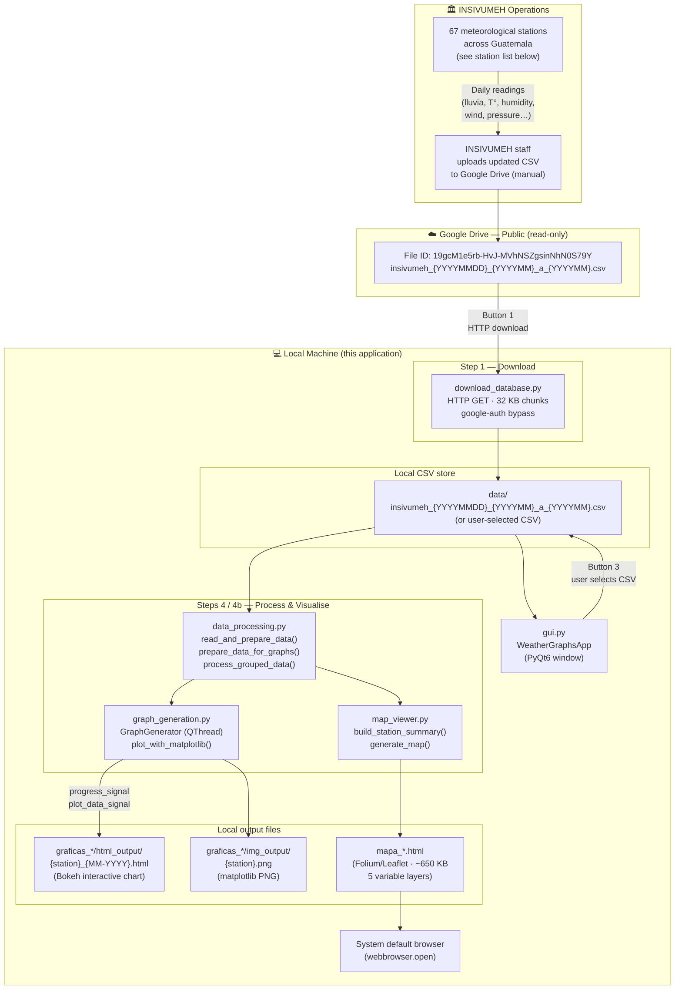

# Graph Generator Monthly
### Generador de Series de Tiempo Mensuales (Últimos 30 días)

A PyQt6 desktop application (Windows) that downloads, processes, and visualises monthly meteorological time-series data from Guatemala's National Meteorological Network (Red Meteorológica Nacional – INSIVUMEH).

**Outputs per run:**

- One interactive Bokeh HTML chart per station (last 30 days, precipitation + temperature)
- One static matplotlib PNG per station
- One interactive Folium/Leaflet station-network map (`mapa_{YYYYMMDD}_{YYYYMM}.html`) opened in the system browser

---

## Table of Contents
1. [Quick Start](#quick-start)
2. [Environment Setup](#environment-setup)
3. [Architecture Overview](#architecture-overview)
4. [Directory Structure](#directory-structure)
5. [Source Files](#source-files)
6. [Data Files & Schemas](#data-files--schemas)
7. [External Services](#external-services)
8. [Inputs & Outputs Reference](#inputs--outputs-reference)
9. [Configuration & Hard-coded Values](#configuration--hard-coded-values)
10. [Threading Model](#threading-model)
11. [Workflow Step-by-Step](#workflow-step-by-step)
12. [Data Flow Diagram](#data-flow-diagram)
13. [Station Coverage](#station-coverage)
14. [Building the Executable](#building-the-executable)
15. [Dependencies](#dependencies)
16. [Notes for Maintainers](#notes-for-maintainers)

---

## Quick Start

```powershell
conda activate graph_generator
python monthly_graph.py
```

The `graph_generator` conda environment is the **only tested working environment**. See [Environment Setup](#environment-setup) for creation instructions.

**Run pre-built executable (Windows, no Python required):**
```
dist/generador_graficos_mensual.exe
```

---

## Environment Setup

The default Anaconda `base` environment has a NumPy version conflict that prevents pandas and folium from loading. A dedicated conda environment is required.

### Create the environment (one-time)

```powershell
conda create -n graph_generator python=3.11 -y

conda install -n graph_generator -c conda-forge ^
    pyqt6 pandas numpy matplotlib folium bokeh ^
    requests google-auth google-auth-httplib2 ^
    google-api-python-client pillow -y
```

### Activate before running

```powershell
conda activate graph_generator
python monthly_graph.py
```

### Why conda instead of `requirements.txt`?

`requirements.txt` lists the 9 minimum runtime packages with floor versions. The conda-managed environment uses newer versions (see [Dependencies](#dependencies)) and manages Qt DLLs correctly via conda-forge, avoiding Windows DLL load failures that occur with pip-installed PyQt6.

**`PyQt6-WebEngine` is intentionally excluded** — it has no conda-forge package and causes DLL errors when pip-installed. The map viewer instead opens the generated map HTML in the system default browser.

---

## Architecture Overview

```
monthly_graph.py              ← Entry point
        ↓
     gui.py                  ← PyQt6 main window, orchestrates all steps
     ├── download_database.py     ← HTTP download of CSV from Google Drive (no auth)
     ├── data_processing.py       ← pandas + Bokeh: CSV → per-station HTML charts
     ├── graph_generation.py      ← matplotlib: CSV → per-station PNG images (QThread)
     └── map_viewer.py            ← folium: CSV → full-network interactive mapa_*.html
```

**Key design decisions:**

- All slow operations (download, graph generation, map generation) run on background `QThread` subclasses (`DownloadWorker`, `GraphWorker`, `MapWorker`) — GUI stays responsive.
- Bokeh produces self-contained interactive HTML per station. Matplotlib produces static PNG per station.
- `map_viewer.py` produces a single `mapa_{YYYYMMDD}_{YYYYMM}.html` covering all stations simultaneously, opened in the system browser.
- Google Drive access is read-only (public download, no auth). The manual CSV upload feature was removed — see `archive/upload_database.py`.

---

## Directory Structure

```
graph_generator_monthly/
├── monthly_graph.py              Entry point
├── gui.py                       PyQt6 main application window (6 workflow steps)
├── data_processing.py           Data preparation + Bokeh HTML generation
├── graph_generation.py          Matplotlib PNG generation (runs via QThread)
├── map_viewer.py                Folium station-network map generation
├── download_database.py         Google Drive public-file downloader
│
├── data/                        CSV data directory
│   ├── insivumeh_YYYYMMDD_YYYYMM_a_YYYYMM.csv   Primary working file — downloaded from Google Drive
│   ├── database.csv             Local historical copy (different date format)
│   ├── onestation.csv           Single-station sample (112 rows, testing only)
│   └── shortscv.csv             Short sample (180 rows, testing only)
│
├── assets/                      Bundled UI image assets
│   ├── logo_insivumeh.png
│   ├── waterco-logo.png
│   ├── IUCN_logo.png
│   └── spinning-loading.gif     Modal loading spinner animation
│
├── archive/                     Archived prototype scripts (not used in production)
│   ├── dataset.py               Original single-threaded Bokeh version
│   ├── dataset2.py              Humidity-focused variant
│   ├── dataset_modified.py      Early PyQt6 integration attempt
│   ├── dataset2_modified.py     Early threading attempt
│   ├── downloadwithlink.py      Google Drive download prototype
│   ├── spinner_test_code_min.py Loading spinner UI test
│   ├── testinplot.py            Bokeh + matplotlib plotting tests
│   └── upload_database.py       Google Drive service-account uploader (archived — replaced by IoT ingestion)
│
├── dev/                         Development and testing scripts (not used in production)
│   ├── test_suite.py            Full test suite (14 checks) — run via conda
│   ├── test_upload.py           Upload smoke-test (hard-coded credentials path)
│   ├── test_filename.py         Timestamped filename logic smoke-test
│   ├── test_imports.py          Import sanity check
│   ├── test_pandas.py           pandas behaviour tests
│   └── _list_stations.py        Utility: list stations in a CSV
│
├── build/                       PyInstaller build artifacts (auto-generated, git-ignored)
├── dist/
│   └── generador_graficos_mensual.exe   Distributable Windows executable (96 MB)
│
├── generador_graficos_mensual.spec   PyInstaller build spec
├── requirements.txt                  Minimal runtime dependencies (pip-installable)
└── readme.md                         This file
```

**Runtime-created output directories** (created automatically on first graph generation):

| Path | Contents |
| --- | --- |
| `<output_dir>/graficas_{YYYYMMDD}_{YYYYMM}_a_{YYYYMM}/html_output/` | Bokeh HTML file per station |
| `<output_dir>/graficas_{YYYYMMDD}_{YYYYMM}_a_{YYYYMM}/img_output/` | Matplotlib PNG file per station |
| `<output_dir>/mapa_{YYYYMMDD}_{YYYYMM}.html` | Single Folium network map (all stations) |

Each graph generation run creates a new uniquely named `graficas_*` folder — re-running never overwrites previous output.

---

## Source Files

### `monthly_graph.py` — Entry Point

**Purpose:** Entry point. Creates a `QApplication`, shows `WeatherGraphsApp`, and enters the Qt event loop.

| | |
| --- | --- |
| **Inputs** | None |
| **Outputs** | Launches the `WeatherGraphsApp` window |
| **Side effects** | None — working directories (`data/`, `assets/`) are created inline by the modules that need them |

| Function | Description |
| --- | --- |
| `main()` | Creates `QApplication`, shows `WeatherGraphsApp`, enters Qt event loop |

---

### `gui.py` — Main Application Window

**Purpose:** PyQt6 GUI with six workflow steps. Coordinates all other modules. All user interaction passes through this file.

| | |
| --- | --- |
| **Inputs** | User interactions (button clicks, file dialogs) |
| **Outputs** | Drives all other modules; updates status label and progress bar |

**Classes and functions:**

| Name | Type | Description |
| ---- | ---- | ----------- |
| `WeatherGraphsApp` | `QWidget` | Main window; 6-step workflow, progress bar, status label |
| `DownloadWorker` | `QThread` | Background thread for CSV download; emits `finished_signal(path, msg)` or `error_signal(msg)` |
| `GraphWorker` | `QThread` | Background thread for graph generation; forwards `progress_signal` and `finished_signal(msg, run_folder_path)` from `GraphGenerator` |
| `MapWorker` | `QThread` | Background thread for map generation; emits `finished_signal(map_path, msg)` or `error_signal(msg)` |
| `LoadingDialog` | `QDialog` | Frameless modal dialog showing `spinning-loading.gif` |
| `resource_path(relative_path)` | function | Resolves asset paths for both dev (`__file__`) and PyInstaller (`_MEIPASS`) bundle contexts |
| `open_map_in_browser(map_path)` | function | Opens a `mapa_*.html` file in the system default browser via `webbrowser.open()` |

**Six workflow steps exposed by the GUI:**

| Step | Button label (ES) | Module called | Output |
| ---- | ----------------- | ------------- | ------ |
| 1 | Bajar base de datos Mensual .CSV de INSIVUMEH | `download_database.py` | `data/insivumeh_{YYYYMMDD}_{YYYYMM}_a_{YYYYMM}.csv` |
| 2 | Seleccionar Directorio de Salida | — (file dialog) | Stores output directory path |
| 3 | Selecionar base de datos .csv a graficar | — (file dialog) | Stores CSV path to process |
| 4 | Generar Graficos mensuales | `graph_generation.py` + `data_processing.py` | HTML + PNG per station |
| 4b | Generar Mapa de Estaciones | `map_viewer.py` | `<output_dir>/mapa_{YYYYMMDD}_{YYYYMM}.html` opened in browser |
| 5 | Explorar graficas generadas | `os.startfile()` | Opens output directory in Explorer |

**Hard-coded values in `gui.py`:**

| Value | Purpose |
| ----- | ------- |
| `19gcM1e5rb-HvJ-MVhNSZgsinNhN0S79Y` | Google Drive file ID to download (Step 1) |
| `data/insivumeh_{YYYYMMDD}_{YYYYMM}_a_{YYYYMM}.csv` | Auto-generated local destination after download (date-stamped) |

> The upload folder ID (`1YufGqLGRrqpWRyGI_Ltv3pHNyu4MVHRM`) was previously hard-coded here. It has been removed along with the upload feature.

---

### `data_processing.py` — Bokeh HTML Generation

**Purpose:** Reads the meteorological CSV, groups records by station, filters to the last 30 days, and saves one interactive Bokeh HTML file per station.

| | |
| --- | --- |
| **Input** | CSV file path, img output directory path, html output directory path |
| **Output** | HTML files in `{output_dir}/html_output/`; returns `plotting_data` dict for matplotlib |

| Function | Signature | Description |
| -------- | --------- | ----------- |
| `detect_date_format` | `(sample: str) → str` | Returns `'%Y-%m-%d'` or `'%d/%m/%Y'` by inspecting a single `fecha` sample string; shared canonical implementation used by `data_processing`, `map_viewer`, and `gui` |
| `read_and_prepare_data` | `(csv_path) → DataFrame` | Reads CSV; parses `fecha` using `detect_date_format()` — supports `%Y-%m-%d` and `%d/%m/%Y` |
| `prepare_data_for_graphs` | `(df) → DataFrameGroupBy` | Groups entire DataFrame by `Nombre` |
| `process_grouped_data` | `(name, group, dir_img, dir_html) → dict` | Per-station: filters 30 days, creates and saves Bokeh plot, returns plotting dict |
| `create_bokeh_plot` | `(data, station_name) → Figure` | Builds dual-axis Bokeh figure (800×400 px) |
| `configure_plot` | `(fig) → None` | Adds right axis, sets ranges and font sizes |
| `add_plot_elements` | `(fig, data) → None` | Adds line + circle glyphs and legend |
| `add_tooltips` | `(fig) → None` | Adds `HoverTool` (date + value, vline mode) |
| `save_plot` | `(fig, name, month_year, dir_html) → None` | Saves HTML via `bokeh.plotting.save` |
| `extract_plotting_data` | `(data, name, dir_img) → dict` | Returns dict with arrays for matplotlib |

**Bokeh chart axes:**

| Axis | Column | Y Range | Colour |
| ---- | ------ | ------- | ------ |
| Left (primary) | `lluvia` — precipitation | −5 to 90 mm | Navy / DeepSkyBlue |
| Right (secondary) | `tseca`, `tmin`, `tmax` — temperatures | −5 to 40 °C | SeaGreen / Blue / Red |

**Output file naming:** `{output_dir}/html_output/{station_name}_{MM-YYYY}.html`

> Date format detection is handled by the shared `detect_date_format(sample)` function (also in `data_processing.py`), which inspects the first non-null value in the `fecha` column — `YYYY-MM-DD` (ISO, primary download file) or `DD/MM/YYYY` (local historical copy). The same function is imported by `map_viewer.py` and `gui.py`.

---

### `graph_generation.py` — Matplotlib PNG Generation

**Purpose:** Iterates stations and renders a three-axis static PNG image for each, emitting Qt signals so the GUI can track progress. Runs inside `GraphWorker` (a `QThread` in `gui.py`) so the GUI event loop is never blocked.

| | |
| --- | --- |
| **Inputs** | CSV file path + output directory (passed to `generate_graphs()`) |
| **Outputs** | PNG files in `{output_dir}/graficas_*/img_output/` |

**Threading model:**

```text
GUI thread                            GraphWorker thread
──────────────────────────────────    ──────────────────────────────────────────
generate_graphs_wrapper()             GraphWorker.run()
  → GraphWorker.start()         ──►     GraphGenerator.generate_graphs()
                                          for each station:
  update_progress() ◄── progress_signal ──  emit progress_signal
                                            plot_with_matplotlib()  ← worker thread
  on_graphs_complete() ◄ finished_signal ──  emit completion_signal(msg, path)
    hide_loading()
    set _last_run_folder
    enable Explore button
```

**Class `GraphGenerator(QObject)` — Qt signals:**

| Signal | Payload | Purpose |
| ------ | ------- | ------- |
| `progress_signal` | `int` (0–100) | Updates GUI progress bar after each station |
| `completion_signal` | `(str, str)` — message + abs folder path | Final status + run folder path; empty string on error |

| Function | Description |
| -------- | ----------- |
| `generate_graphs(output_dir, csv_path)` | Reads CSV, builds descriptive run folder, iterates stations, calls `plot_with_matplotlib()` directly (worker thread), emits both signals |
| `plot_with_matplotlib(data_dict)` | Creates 12×5 inch three-axis figure, saves PNG; per-station failures are logged as warnings without aborting the loop |

**Matplotlib chart axes:**

| Axis position | Column | Y range | Style |
| ------------- | ------ | ------- | ----- |
| Left | `lluvia` — precipitation (mm) | −5 to 90 | Solid blue line |
| Right | `tseca` — mean temp (°C) | −5 to 40 | Solid green line |
| Right | `tmin` — min temp (°C) | −5 to 40 | Dashed DeepSkyBlue line |
| Right | `tmax` — max temp (°C) | −5 to 40 | Dashed FireBrick line |
| Far right (+60 pt) | `hum_rel` — relative humidity (%) | 0 to 100 | Dotted darkorange line |

**Output folder naming** — mirrors the download file convention:

```text
{output_dir}/graficas_{run_date}_{data_start}_a_{data_end}/
               │          │         │               └─ latest month in the CSV
               │          │         └─ earliest month in the CSV
               │          └─ date graphs were generated (YYYYMMDD)
               └─ output type identifier

├── img_output/    ← matplotlib PNG files   ({station_name}.png)
└── html_output/   ← Bokeh interactive HTML ({station_name}_{MM-YYYY}.html)
```

Each generation run creates a new uniquely named folder — re-running never overwrites previous output.

---

### `map_viewer.py` — Folium Station-Network Map

**Purpose:** Reads the CSV, aggregates the last 30 days per station, and generates a single self-contained `mapa_{YYYYMMDD}_{YYYYMM}.html` showing all stations on an interactive Leaflet map. The map has multiple switchable layers and a click-popup with all stats per station.

| | |
| --- | --- |
| **Inputs** | CSV file path (passed to `build_station_summary()`), output directory |
| **Outputs** | `{output_dir}/mapa_{YYYYMMDD}_{YYYYMM}.html` — fully self-contained Leaflet HTML (~650 KB, no server required) |
| **Requirements** | Stations must have non-null `Latitud` and `Longitud` columns |

**Module-level constants:**

| Constant | Value | Description |
| -------- | ----- | ----------- |
| `GUATEMALA_CENTER` | `[15.5, -90.3]` | Default map centre (latitude, longitude) |
| `DEFAULT_ZOOM` | `7` | Initial Leaflet zoom level |
| `VARIABLES` | dict (5 keys) | Per-variable label, unit, colormap, and radius config (see below) |

**`VARIABLES` configuration — one entry per map layer:**

| Key | Label | Colormap | Radius behaviour |
| --- | ----- | -------- | ---------------- |
| `lluvia_total` | Precipitación Total 30d (mm) | Blues | Scales with √(value), 5–22 px |
| `tseca_mean` | Temperatura Media 30d (°C) | RdYlBu_r | Fixed 8 px |
| `tmax_mean` | Temperatura Máx. 30d (°C) | Reds | Fixed 8 px |
| `tmin_mean` | Temperatura Mín. 30d (°C) | Blues_r | Fixed 8 px |
| `hum_rel_mean` | Humedad Relativa 30d (%) | YlGnBu | Fixed 8 px |

**Public functions:**

| Function | Signature | Description |
| -------- | --------- | ----------- |
| `build_station_summary` | `(csv_path: str) → DataFrame` | Reads CSV, detects date format, filters last 30 days globally, aggregates per station, attaches lat/lon/alt. Returns one row per station. Raises `ValueError` if no stations have coordinates. |
| `generate_map` | `(summary: DataFrame, output_dir: str) → str` | Builds Folium map with all layers, saves `mapa_{YYYYMMDD}_{YYYYMM}.html` (dated filename), returns absolute path. |

**Output file naming:**

```text
mapa_{run_date}_{data_month}.html

Example:  mapa_20260313_202603.html
           │       │        └─ latest data month in the CSV
           │       └─ date the map was generated (YYYYMMDD)
           └─ output type identifier
```

**Private helpers (not called externally):**

| Function | Description |
| --- | --- |
| `_value_to_hex(value, vmin, vmax, cmap_name)` | Scalar → hex colour string via matplotlib colormap. Returns `#aaaaaa` for NaN. |
| `_value_to_radius(value, vmin, vmax, rmin, rmax)` | Scalar → circle radius using √-scaling |
| `_popup_html(row)` | `pd.Series` → HTML table string shown in marker popup |
| `_add_variable_layer(m, summary, var_key, show)` | Adds one `folium.FeatureGroup` of CircleMarkers to the map |

**`build_station_summary` output DataFrame columns:**

| Column | Type | Description |
| ------ | ---- | ----------- |
| `Nombre` | str | Station name (underscores, e.g. `TECUN_UMAN`) |
| `station_id` | str | Station code (`ID` or `estacion` column, whichever exists) |
| `Latitud` | float | WGS-84 latitude (decimal degrees) |
| `Longitud` | float | WGS-84 longitude (decimal degrees) |
| `Altitud` | float | Altitude (metres) |
| `lluvia_total` | float | Sum of `lluvia` over last 30 days (mm) |
| `tseca_mean` | float | Mean of `tseca` over last 30 days (°C) |
| `tmin_mean` | float | Mean of `tmin` over last 30 days (°C) |
| `tmax_mean` | float | Mean of `tmax` over last 30 days (°C) |
| `hum_rel_mean` | float | Mean of `hum_rel` over last 30 days (%) |
| `vel_viento_mean` | float | Mean wind speed over last 30 days (km/h) |
| `dir_viento_mean` | float | Mean wind direction over last 30 days (degrees) |
| `last_fecha` | Timestamp | Most recent observation date for the station |
| `n_days` | int | Number of daily records in the 30-day window |

**map.html layer structure:**

| Layer type | Name in LayerControl | Default visible |
| ---------- | -------------------- | --------------- |
| Base tile | OpenStreetMap | Yes (radio) |
| Base tile | Satélite (Esri) | No (radio) |
| Base tile | Topografía (Esri) | No (radio) |
| CircleMarkers | Precipitación Total 30d (mm) | Yes |
| CircleMarkers | Temperatura Media 30d (°C) | No |
| CircleMarkers | Temperatura Máx. 30d (°C) | No |
| CircleMarkers | Temperatura Mín. 30d (°C) | No |
| CircleMarkers | Humedad Relativa 30d (%) | No |
| HeatMap | Mapa de calor (Lluvia) | No |

Each CircleMarker has a hover tooltip (station name + value) and a click popup (HTML table with all 30-day stats).

---

### `download_database.py` — Google Drive Downloader

**Purpose:** Downloads a publicly shared Google Drive file using chunked streaming with confirmation token handling for large files.

| | |
| --- | --- |
| **Inputs** | `file_id` (string), `destination` (file path string) |
| **Outputs** | File written to `destination` |
| **Returns** | `True` on success, `False` on failure |

| Function | Description |
| --- | --- |
| `download_file_from_google_drive(file_id, destination)` | Main entry: opens session, handles token, calls `save_response_content` |
| `_extract_token(response)` | Extracts confirmation token from cookie (legacy) or HTML body regex (current GDrive behaviour) |
| `save_response_content(response, destination)` | Streams response to disk in 32 KB chunks; raises `ValueError` if first bytes are HTML |

**URL pattern:** `https://drive.google.com/uc?export=download&id={file_id}`
**Authentication:** None required — file must be publicly shared on Google Drive.

---

### `upload_database.py` — Google Drive Uploader *(archived)*

> **This module has been moved to `archive/upload_database.py` and is no longer part of the active application.**
> The manual CSV upload feature was a prototype that required users to supply a service account JSON key. It was removed in favour of an IoT-based data ingestion solution that provides better data integrity: no human file-selection, schema validation at ingestion, and no credential distribution to field users.

~~**Purpose:** Authenticates with a Google service account and uploads a CSV file to a designated shared folder.~~

For reference, the module accepted `file_path` (local CSV) and `service_account_file` (path to `.json` credentials), uploaded to parent folder `1YufGqLGRrqpWRyGI_Ltv3pHNyu4MVHRM` using Google Drive API v3, and returned the new `file_id`.

---

### `dev/test_upload.py` — Development Smoke Test

**Purpose:** Standalone script to manually test the upload flow outside the GUI.

> **Warning:** Contains hard-coded local Windows paths to a service account JSON file. Do **not** commit actual credentials. This file is for local development use only and is not part of the application.

---

## Data Files & Schemas

### `data/insivumeh_{YYYYMMDD}_{YYYYMM}_a_{YYYYMM}.csv` — Primary Working File

Source: downloaded from Google Drive in Step 1. This is the file used for all processing.

**Filename format:**

```
insivumeh_{download_date}_{data_start}_a_{data_end}.csv

Example:  insivumeh_20260313_202304_a_202602.csv
           │           │         │       └─ latest month in the data
           │           │         └─ earliest month in the data
           │           └─ date the file was downloaded (YYYYMMDD)
           └─ source identifier
```

| Column | Type | Description |
| ------ | ---- | ----------- |
| `fecha` | date (`YYYY-MM-DD`) | Observation date |
| `ID` | string | Station code (e.g. `INS121701CV`) |
| `Nombre` | string | Station name with underscores (e.g. `TECUN_UMAN`) |
| `lluvia` | float | Precipitation (mm) |
| `tmin` | float | Minimum temperature (°C) |
| `tseca` | float | Mean/dry bulb temperature (°C) |
| `tmax` | float | Maximum temperature (°C) |
| `eva_tan` | float | Tanque evaporation (mm) |
| `eva_piche` | float | Piche evaporation (mm) |
| `hum_rel` | float | Relative humidity (%) |
| `bri_solar` | float | Solar brightness (hours) |
| `nub` | float | Cloud cover (0–8 okta scale) |
| `vel_viento` | float | Wind speed (km/h) |
| `dir_viento` | float | Wind direction (degrees, 0–360) |
| `pre_atmos` | float | Atmospheric pressure (mb) |
| `rad_solar` | float | Solar radiation (W/m²) |
| `tsuelo_50` | float | Soil temperature at 50 cm depth (°C) |
| `tsuelo_100` | float | Soil temperature at 100 cm depth (°C) |
| `Fenomenos/0`–`Fenomenos/10` | int (0 or 1) | Binary weather phenomenon indicators (11 columns) |
| `ID_INSIVUMEH` | string | Secondary INSIVUMEH station identifier |
| `Latitud` | float | Station latitude, WGS-84 decimal degrees |
| `Longitud` | float | Station longitude, WGS-84 decimal degrees |
| `Altitud` | float | Station altitude (metres above sea level) |

**Approximate row count:** 15,000+ (multi-station, multi-year)
**Sparse data:** Many cells are empty — not all stations report all variables on all days.

---

### `data/database.csv` — Local Historical Copy

Older local file with a different structure. Not used by default — only used if manually selected in Step 3.

| Difference | `database.csv` | primary download file |
| --- | --- | --- |
| Date format | `DD/MM/YYYY` | `YYYY-MM-DD` (ISO) |
| Station ID column | `estacion` | `ID` |
| Extra columns | `Unnamed: 0`, `tsuelo_5` | `ID_INSIVUMEH` |
| Missing columns | `ID_INSIVUMEH` | `Unnamed: 0`, `tsuelo_5` |
| Approximate rows | 6,600 | 15,000+ |

**Compatibility:** All processing modules (`data_processing.py`, `map_viewer.py`, `gui.py`) use the shared `detect_date_format` function from `data_processing.py` — both CSV formats work correctly with all modules.

---

### `data/onestation.csv` and `data/shortscv.csv`

Small sample files (112 and 180 rows respectively) with the same schema as `database.csv`. Used only for quick local testing.

---

## External Services

### 1. Google Drive — Public File Download

| Attribute | Value |
| --- | --- |
| Direction | Inbound (remote → local) |
| URL pattern | `https://drive.google.com/uc?export=download&id={file_id}` |
| File ID | `19gcM1e5rb-HvJ-MVhNSZgsinNhN0S79Y` |
| Authentication | None (file is publicly shared) |
| Triggered by | GUI Step 1 |
| Local destination | `data/insivumeh_{YYYYMMDD}_{YYYYMM}_a_{YYYYMM}.csv` (auto-named after download) |
| Implementation | `download_database.py` — chunked streaming, 32 KB per chunk |

### 2. Google Drive — Authenticated File Upload *(removed)*

> **This service is no longer used by the application.** The manual CSV upload feature (GUI Steps 6 and 7) was removed in favour of an IoT-based data ingestion solution. The implementation has been moved to `archive/upload_database.py` for reference.

| Attribute | Value |
| --- | --- |
| Direction | Outbound (local → remote) |
| API | Google Drive API v3 |
| API endpoint | `https://www.googleapis.com/upload/drive/v3/files` |
| Authentication | Service Account (JSON key file supplied by user) |
| OAuth scope | `https://www.googleapis.com/auth/drive` |
| Target folder ID | `1YufGqLGRrqpWRyGI_Ltv3pHNyu4MVHRM` |
| Upload filename | `{MONTH}_{YEAR}_{original_filename}` |
| Triggered by | GUI Step 7 — **removed** |
| Credential file | Selected by user in GUI Step 6 — **removed** |
| Implementation | `archive/upload_database.py` — `google-api-python-client` Drive v3 |

### 3. Esri tile servers — Map basemaps (read-only, no auth)

Used by the generated map HTML when opened in a browser. Requires internet access to render tiles.

| Tile URL | Layer name |
| -------- | ---------- |
| `https://server.arcgisonline.com/ArcGIS/rest/services/World_Imagery/MapServer/tile/{z}/{y}/{x}` | Satélite (Esri) |
| `https://server.arcgisonline.com/ArcGIS/rest/services/World_Topo_Map/MapServer/tile/{z}/{y}/{x}` | Topografía (Esri) |

OpenStreetMap tiles are also used and are the default basemap.

---

## Inputs & Outputs Reference

### Inputs

| Input | Where it comes from | Format | Consumed by |
| ----- | ------------------- | ------ | ----------- |
| Meteorological CSV | Google Drive (Step 1) or local file dialog (Step 3) | CSV | `data_processing.py`, `graph_generation.py`, `map_viewer.py` |
| Output directory | User via file dialog (Step 2) | Folder path | `graph_generation.py`, `map_viewer.py` |
| UI image assets | `assets/` folder (bundled) | PNG, GIF | `gui.py` |

### Outputs

| Output | Location | Format | Size | Produced by |
| ------ | -------- | ------ | ---- | ----------- |
| Per-station interactive charts | `<output_dir>/graficas_{YYYYMMDD}_{YYYYMM}_a_{YYYYMM}/html_output/{station}_{MM-YYYY}.html` | Bokeh HTML | ~50–200 KB each | `data_processing.py` |
| Per-station static images | `<output_dir>/graficas_{YYYYMMDD}_{YYYYMM}_a_{YYYYMM}/img_output/{station}.png` | PNG (12×5 in) | ~80–200 KB each | `graph_generation.py` |
| Network map | `<output_dir>/mapa_{YYYYMMDD}_{YYYYMM}.html` | Folium/Leaflet HTML | ~650 KB | `map_viewer.py` |

---

## Configuration & Hard-coded Values

All configurable values are embedded directly in source code. There are no `.env` files or external config files.

| Parameter | File | Value | How to change |
| --- | --- | --- | --- |
| Download file ID | `gui.py` — module constant `GDRIVE_FILE_ID` | `19gcM1e5rb-HvJ-MVhNSZgsinNhN0S79Y` | Edit the constant |
| Date window | `data_processing.py`, `map_viewer.py` | Last 30 days from dataset max date | Change `pd.Timedelta(days=30)` |
| Bokeh precipitation Y range | `data_processing.py` | −5 to 90 mm | Edit `y_range=(-5, 90)` |
| Bokeh temperature Y range | `data_processing.py` | −5 to 40 °C | Edit `Range1d(start=-5, end=40)` |
| Bokeh figure dimensions | `data_processing.py` | 800 × 400 px | Edit `height=400, width=800` |
| Matplotlib figure dimensions | `graph_generation.py` | 10 × 5 inches | Edit `figsize=(10, 5)` |
| Matplotlib temperature Y range | `graph_generation.py` | −5 to 40 °C | Edit `ax2.set_ylim(-5, 40)` |
| Download chunk size | `download_database.py` | 32,768 bytes (32 KB) | Edit `CHUNK_SIZE` constant |
| Map centre | `map_viewer.py` | `[15.5, -90.3]` (Guatemala) | Edit `GUATEMALA_CENTER` |
| Map default zoom | `map_viewer.py` | `7` | Edit `DEFAULT_ZOOM` |
| Precipitation marker radius range | `map_viewer.py` `VARIABLES` | 5–22 px | Edit `rmin`/`rmax` in `lluvia_total` entry |
| Heatmap radius / blur | `map_viewer.py` | radius=35, blur=25 | Edit `HeatMap(...)` call |

---

## Threading Model

```
Main Thread (Qt Event Loop)
│
├── All GUI rendering and user input handling
│
├── Step 1 – Download (DownloadWorker thread)
│   └── download_file_from_google_drive()   [~1–30 s]
│       finished_signal(path, msg) ──► _on_download_complete()
│       error_signal(msg)          ──► _on_download_error()
│
├── Step 4 – Generate graphs (GraphWorker thread)
│   └── GraphGenerator.generate_graphs()
│       ├── calls plot_with_matplotlib() per station  [all on worker thread]
│       ├── Emits progress_signal(int 0–100)  → progress bar update
│       └── Emits completion_signal(msg, path) → on_graphs_complete()
│               hide_loading · set _last_run_folder · enable Explore button
│
└── Step 4b – Generate map (MapWorker thread)
    └── build_station_summary() + generate_map()   [~1–5 s]
        finished_signal(map_path, msg) ──► _on_map_complete()
        error_signal(msg)              ──► _on_map_error()
```

**All three slow operations** (download, graph generation, map generation) run on background `QThread` subclasses — the GUI event loop is never blocked.

---

## Workflow Step-by-Step

```
1. USER launches app
   └─ monthly_graph.py: configure logging → show WeatherGraphsApp window

2. STEP 1 – Download database  [DownloadWorker thread]
   GUI → DownloadWorker.start()
     └─ download_database.py: HTTP GET google.com/uc?id=19gcM1e5rb-...
     └─ Chunked write → data/_download_temp.csv
     └─ Inspect fecha column → build dated filename
     └─ Rename → data/insivumeh_{YYYYMMDD}_{YYYYMM}_a_{YYYYMM}.csv
   finished_signal → csv_edit auto-filled, QMessageBox shown

3. STEP 2 – Select output directory
   GUI → QFileDialog.getExistingDirectory()
   → stores path in directory_edit field

4. STEP 3 – Select CSV to process
   GUI → QFileDialog.getOpenFileName(*.csv)
   → stores path in csv_edit field
   (auto-filled after Step 1 completes)

5. STEP 4 – Generate monthly graphs  [GraphWorker thread]
   GUI → GraphWorker.start()
     └─ data_processing.py:
        read_and_prepare_data() → filter last 30 days → group by Nombre
        per station:
          create_bokeh_plot() → save HTML
          plot_with_matplotlib() → save PNG  ← runs on worker thread
          emit progress_signal(%) → progress bar 0→100%
     └─ emit completion_signal(msg, run_folder_path)
   on_graphs_complete() → hide spinner, set _last_run_folder, enable Explore button

6. STEP 4b – Generate station network map  [MapWorker thread]
   GUI → MapWorker.start()
     └─ map_viewer.build_station_summary(csv_path)
          read CSV → detect date format → filter last 30 days
          group by Nombre → aggregate 9 variables → attach Latitud/Longitud/Altitud
     └─ map_viewer.generate_map(summary, output_dir)
          build folium.Map with 3 base tiles
          add 5 CircleMarker FeatureGroup layers + HeatMap layer
          add LayerControl, title banner, legend hint
          save → <output_dir>/mapa_{YYYYMMDD}_{YYYYMM}.html
   finished_signal → open_map_in_browser() · status label updated

7. STEP 5 – Explore generated graphs
   GUI → os.startfile(_last_run_folder)   [Windows; xdg-open / open on other OS]
   Opens graficas_{YYYYMMDD}_{YYYYMM}_a_{YYYYMM}/ subfolder in Explorer
```

---

## Data Flow Diagram

### End-to-end data exchange



> The authenticated Google Drive upload path (previously shown as `CLOUD_OUT`) has been removed. The application is now read-only with respect to Google Drive.

### Low-level transfer details

```
╔══════════════════════════════════════════════════════════════════════╗
║  GOOGLE DRIVE (Public)                                               ║
║  File ID: 19gcM1e5rb-HvJ-MVhNSZgsinNhN0S79Y                         ║
╚══════════════════╦═══════════════════════════════════════════════════╝
                   ║  HTTP GET  (requests, 32 KB chunks)
                   ║  download_database.py::download_file_from_google_drive()
                   ▼
      data/insivumeh_{YYYYMMDD}_{YYYYMM}_a_{YYYYMM}.csv
      columns: fecha · ID · Nombre · lluvia · tmin · tseca · tmax
               eva_tan · eva_piche · hum_rel · bri_solar · nub
               vel_viento · dir_viento · pre_atmos · rad_solar
               tsuelo_50 · tsuelo_100 · Fenomenos/0-10
               ID_INSIVUMEH · Latitud · Longitud · Altitud
                   │
      ┌────────────┼──────────────────────────────────┐
      │            │                                  │
      ▼            ▼                                  ▼
data_processing  graph_generation               map_viewer
(pandas)         (matplotlib)                   (folium/leaflet)
      │            │                                  │
 group Nombre   group Nombre                    group Nombre
 filter 30d     filter 30d                      filter 30d global
 Bokeh chart    dual-axis PNG                   9-variable aggregate
      │            │                            attach lat/lon/alt
      ▼            ▼                                  │
 graficas_*/    graficas_*/                            ▼
 html_output/   img_output/           <output_dir>/mapa_*.html
 *.html         *.png
                                              (5 marker layers +
                                               1 heatmap layer)
                                                      │
                                                      ▼
                                           system default browser
```

> The authenticated Google Drive upload path that previously appeared here has been removed. The application is now read-only with respect to Google Drive.

---

## Station Coverage

The network covers **67 stations** operated by INSIVUMEH across Guatemala. Stations span altitudes from sea level (2 m) to high-altitude sites above 3 300 m, covering all major climatic zones: Pacific lowlands, Caribbean coast, central highlands, Petén rainforest, and border regions.

### Geographic summary

| Region | Approx. stations |
| --- | --- |
| Central highlands (Guatemala City metro, Sacatepéquez, Chimaltenango) | ~15 |
| Western highlands (Quetzaltenango, Huehuetenango, Quiché, San Marcos) | ~18 |
| Pacific coast & piedmont (Retalhuleu, Escuintla, Suchitepéquez) | ~7 |
| Eastern lowlands & Oriente (Jalapa, Chiquimula, Zacapa, El Progreso) | ~10 |
| Caribbean & Izabal (Puerto Barrios, Mariscos, Morales) | ~5 |
| Petén (Flores, Poptún, Playa Grande) | ~4 |
| Verapaces (Cobán, Cahabón, Panzós, Cubulco) | ~6 |
| Other / border | ~2 |

### Full station list

| Station name (CSV) | Latitude | Longitude | Altitude (m) |
| --- | --- | --- | --- |
| ALAMEDA_ICTA | 14.638 | -90.804 | 1 750 |
| AMATITLAN | 14.468 | -90.630 | 1 205 |
| AMATITLAN_DOS | — | — | — |
| ANTIGUA_GUATEMALA | 14.540 | -90.738 | 1 539 |
| ASUNCION_MITA | 14.335 | -89.706 | 478 |
| CAMOTAN | 14.822 | -89.375 | 450 |
| CATARINA | 14.856 | -92.075 | 233 |
| CHAMPERICO_FEGUA | 14.294 | -91.914 | 5 |
| CHINIQUE | 15.047 | -91.020 | 1 880 |
| CHIXOY_PCH | 15.358 | -90.661 | 680 |
| COBAN | 15.470 | -90.406 | 1 323 |
| CONCEPCION | 14.324 | -90.788 | 421 |
| CUBULCO | 15.109 | -90.621 | 994 |
| EL_CAPITAN | 14.644 | -91.141 | 1 562 |
| EL_TABLON | 14.790 | -91.182 | 2 397 |
| ESQUIPULAS | 14.560 | -89.341 | 950 |
| FLORES_AEROPUERTO | 16.916 | -89.867 | 123 |
| HUEHUETENANGO | 15.318 | -91.502 | 1 870 |
| INSIVUMEH | 14.587 | -90.533 | 1 502 |
| IXCHIGUAN | 15.165 | -91.940 | 3 336 |
| LA_AURORA | 14.586 | -90.528 | 1 491 |
| LA_CEIBITA | 14.495 | -89.879 | 960 |
| LA_FRAGUA | 14.966 | -89.584 | 227 |
| LA_REFORMA | 14.800 | -91.817 | 1 133 |
| LA_UNION | 14.963 | -89.291 | 1 000 |
| LABOR_OVALLE | 14.871 | -91.514 | 2 380 |
| LAS_NUBES | 14.552 | -90.317 | — |
| LAS_VEGAS_PHC | 15.585 | -88.945 | 10 |
| LO_DE_COY | 14.621 | -90.599 | 1 686 |
| LOS_ALBORES | 15.053 | -89.949 | 1 391 |
| LOS_ALTOS | 14.860 | -91.508 | 2 389 |
| LOS_ESCLAVOS | 14.253 | -90.278 | 737 |
| MARISCOS | 15.429 | -89.078 | 16 |
| MAZATENANGO | 14.528 | -91.503 | 352 |
| MONTUFAR | 13.809 | -90.154 | 29 |
| MORALES_MET | 15.478 | -88.824 | 123 |
| NEBAJ | 15.399 | -91.142 | 1 906 |
| NENTON | 15.803 | -91.753 | — |
| NUEVA_CONCEPCION | 14.868 | -91.683 | 2 877 |
| PACHUTE | 14.983 | -91.574 | 2 682 |
| PANZOS_PHC_ALTA_VERAPAZ | 15.397 | -89.644 | 33 |
| PASABIEN | 15.030 | -89.679 | 260 |
| PLAYA_GRANDE_IXCAN | 15.989 | -90.740 | 186 |
| POPTUN | 16.326 | -89.410 | 479 |
| POTRERO_CARRILLO | 14.750 | -89.934 | 1 760 |
| PUERTO_BARRIOS_PHC | 15.730 | -88.584 | 2 |
| QUEZADA | 14.233 | -90.036 | 980 |
| RETALHULEU_AEROPUERTO | 14.525 | -91.694 | 205 |
| SABANA_GRANDE | 14.374 | -90.831 | 730 |
| SACAPULAS | 15.291 | -91.092 | 1 180 |
| SAN_AGUSTIN_ACASAGUASTLAN | 14.950 | -89.974 | 371 |
| SAN_JERONIMO_R_H | 15.061 | -90.252 | 1 000 |
| SAN_JOSE_AREOPUERTO | 13.937 | -90.835 | 6 |
| SAN_JOSE_PINULA | 14.524 | -90.392 | 1 744 |
| SAN_MARCOS_PHC | 14.967 | -91.823 | 2 420 |
| SAN_MARTIN_JILOTEPEQUE | 14.777 | -90.793 | 1 800 |
| SAN_PEDRO_AYAMPUC | 14.783 | -90.450 | 1 269 |
| SAN_PEDRO_NECTA | 15.495 | -91.762 | 1 641 |
| SANTA_CRUZ_BALANYA | 14.683 | -90.919 | 2 080 |
| SANTA_CRUZ_DEL_QUICHE | 15.050 | -91.154 | 2 082 |
| SANTA_MARGARITA | 14.506 | -91.011 | 1 137 |
| SANTA_MARIA_CAHABON | 15.608 | -89.812 | 380 |
| SANTIAGO_ATITLAN | 14.631 | -91.233 | 1 569 |
| SUIZA_CONTENTA | 14.619 | -90.659 | 2 105 |
| TECUN_UMAN | 14.702 | -92.128 | 29 |
| TODOS_SANTOS | 15.508 | -91.600 | 2 480 |
| TOTONICAPAN | 14.911 | -91.364 | 2 478 |

> Stations with `—` coordinates are present in the CSV but lack `Latitud`/`Longitud` values. They appear in time-series charts but are **excluded from the map** by `build_station_summary()`.

---

## Building the Executable

```powershell
conda activate graph_generator
pyinstaller generador_graficos_mensual.spec
```

Output: `dist/generador_graficos_mensual.exe` (~96 MB, self-contained Windows executable)

The `.spec` file bundles these assets and library data files:

- `assets/logo_insivumeh.png`
- `assets/waterco-logo.png`
- `assets/IUCN_logo.png`
- `assets/spinning-loading.gif`
- All `folium` template/data files (`collect_data_files('folium')`)
- All `bokeh` template/data files (`collect_data_files('bokeh')`)

---

## Dependencies

Actual versions confirmed working in the `graph_generator` conda environment:

| Package | Version | Purpose |
| ------- | ------- | ------- |
| Python | 3.11 | Runtime |
| PyQt6 | 6.8.1 | GUI framework (installed via conda-forge for correct Windows DLLs) |
| pandas | 3.0.1 | CSV parsing, DataFrame operations, date handling |
| numpy | 2.4.2 | Numerical arrays used by matplotlib and map_viewer |
| matplotlib | 3.10.8 | Static PNG chart generation; colourmap-to-hex conversion in map_viewer |
| folium | 0.20.0 | Leaflet.js map generation (map_viewer.py) |
| bokeh | 3.9.0 | Interactive HTML chart generation |
| requests | 2.32.3 | HTTP chunked download from Google Drive |
| google-auth | 2.49.1 | Service account authentication |
| google-auth-httplib2 | 0.3.0 | HTTP transport adapter for google-auth |
| google-api-python-client | 2.192.0 | Google Drive API v3 client |
| Pillow | — | Logo image handling in GUI |

**Not installed / not needed:**

- `PyQt6-WebEngine` — no conda-forge package; map opens in system browser instead
- `selenium` / `chromedriver` — original PNG export method, replaced by matplotlib

---

## Notes for Maintainers

**Environment:**

- Always use the `graph_generator` conda environment. The base Anaconda environment fails due to a NumPy 1.x/2.x ABI conflict in pyarrow.
- `requirements.txt` lists minimum pip-compatible versions. The conda install commands in [Environment Setup](#environment-setup) are the recommended path — conda-forge manages Qt DLLs correctly on Windows.

**Date formats:**

- Primary download file (`insivumeh_*.csv`): `YYYY-MM-DD` (ISO)
- Local historical copy (`database.csv`): `DD/MM/YYYY`
- Both `data_processing.py` and `map_viewer.py` auto-detect the format — no manual adjustment needed when switching between files.

**Google Drive IDs:**

- The download file ID in `gui.py` is the only value that needs to change when deploying to a different Google Drive environment. The upload folder ID (`1YufGqLGRrqpWRyGI_Ltv3pHNyu4MVHRM`) is no longer used — it remains only in `archive/upload_database.py` for reference.

**Map viewer — internet required:**

- `mapa_*.html` loads Leaflet JS from CDN and Esri/OSM tile servers. It will render station markers offline but map tiles will not appear without internet access.

**`dev/test_upload.py`:**

- Contains a hard-coded path to a service account JSON file (`C:\keyfile\clean-trees-410621-753ef42ab44d.json`). Never commit actual credentials. This file is dev scaffolding only.

**`archive/`:**

- All scripts in this folder are superseded by the current architecture and not imported by any production code. They are retained for historical reference only.
